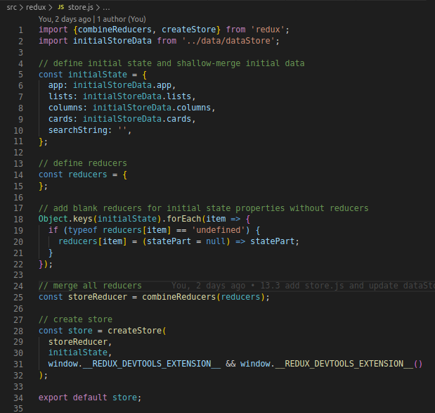

# todolist

## React

## Redux
`Redux` - is a library that helps managing the application **state**. It implements store which is an object that stores application **state**. It contains also package of methods that allows the `store` handling
>Zasada działania Reduksa jest w miarę prosta: komponent zgłasza chęć zmiany stanu aplikacji, magazyn decyduje, czy wprowadzić tę zmianę, a jeśli ją wprowadzi – informuje o tym wszystkie komponenty, korzystające ze zmienionych danych.

+ Each component can be modified so that it can read application **state** from the `store`. Thanks to that `Column` can display `Card`'s which contains (which are assigned to the `Column`). It will be reendered always when data which are read by this component change.
+ If component wats to change application **state** (e.g add new `Card`) it create and sends an **Action** to the store. An **Action** is just a communicate that says >"I want to implement change in application state, here are the change details".
+ Then the store will take an action and will try to change application state (if we provided a function to handle particular **Action** and the data carried by **Action* are correct)
+ If the `store` changed an application state then all components that uses changed data will be reendered. Thanks to this for example if new `Card` is added it will be displayed in proper `Column`.
>W ten sposób zatoczyliśmy koło, zaczynając i kończąc na komponencie. To trochę tak, jakbyśmy chcieli zawrócić na rondzie – musimy >przejechać dookoła całego ronda. Bardzo ważne jest to, że po tym rondzie jeździmy tylko w jednym kierunku! Komponent sam nie może >bezpośrednio zmienić stanu aplikacji, ani wyświetlić karty, która nie została jeszcze dodana do magazynu.

>Może się to pozornie wydawać ograniczeniem, ale w rzeczywistości pozwoli to na zachowanie porządku i uniknięcie poważnych problemów.

>Oczywiście, to tylko bardzo ogólny opis działania Reduksa – pozwoli nam szybko zacząć używać Reduksa i w praktyce zrozumieć jego >działanie. Dopiero wtedy poruszymy szczegóły każdego z opisanych powyżej etapów jego działania.

****

## 13.3
Flow:
1. `dataStore.js` contains the props that are unpacked to new objects in const `initialStoreData`


2. `store.js` imports`initialStoreData` and uses it in newly defined const `initialState`


3. `Index.js` imports `store.js` and through the `Provider` it makes the Redux store available to the connect() calls in the component hierarchy


4. `App.js` receives props from `store.js` through `Provider`


5. `AppContainer.js`
- imports a component for which it is a container: `App.js`
- contains const mapStateToProps which contains a fuction that defines binding props with a state
- exports a `connect` (which is imported from `react-redux`) that returns another function that connect a component with a state according to defined arguments. This returned function is initiated with an argument `App`. A result of function returned by another function is exported and can be used in other components like it was a component `App`.
.

### ListContainer getColumnsForLists:
1. `ListContainer.js` contains `getColumnsForLists` method that returns `Columns` only for the `List` with proper `listId`.


## 13.4

### change of the apllication state through dispatched action:
1. `mapDispatchToProps` add props to component (value of props is a funtion that dispatch actions to the `store`). It's an action that signalizes a wish to change an application state.
`dispatch` function is an argument of `mapDispatchToProps`. It dispatches an action to the `store`.
2. `AddColumn` receives an argument "*title*". Base on this argument `dispatch` function will be initialed
3. In order to create an `action` we use `createActionAddColumn` (defined in `columnRedux.js`).
The fuction has 2 arguments: "*title: title*" and "*listId: props.id*"

Selector in Redux is a function that filters out defined application state (wg. displaying only selected columns in proper list)

4. gerColumnsForList selects columns from proper list (based on listId parameter). "*state*"
 needs to be the first argument in the function ("*state*" is the whole application state). Thanks to that in `ListContainer` we don;t need to know the whole application's state structure - we don;t care if `Column` is *`state.columns`* or *`state.toDoApp.columns`* or other. It;s important for the future changes to the application's state structure (we want to make changes only in the files located in src/redux and the components containers can be not *aware* of the state changes).
 In `reducerName` we store te store.props on which we are going to dispatch the action (e.g for columns the `reducerName` = `columns`)
 

 1. `addColumn` is defined in `ListContainer.js` and then used in `List.js`
 2. `Creator` dispatch and `action`  with `addColumn`
 3. Reducer reacts on the dispatched action and initialize the function received in prop `action`. This initializes dispatching an action to the `store`. The `store` will initialize all the reducers


 1. the **reducer** alsways returns the **state**.
   If action type is correct (fits to ADD_COLUMN) in `switch` then it will initialize a function that will update the application **State**.

 2. The **reducer** has to be a *clean_* function:
>Funkcja czysta to taka funkcja, która zawsze da ten sam rezultat, jeśli dostanie te same argumenty. Zobaczmy przykład funkcji czystej:
>
>const addNumbers = (a, b) => a + b;
>
>console.log( addNumbers(2, 3) ); // 5
>console.log( addNumbers(2, 3) ); // 5
>console.log( addNumbers(2, 3) ); // 5
>Jak widzisz, wykonaliśmy tę funkcję kilka razy z tymi samymi argumentami, i za każdym razem otrzymaliśmy ten sam wynik. Nie ma niczego, co moglibyśmy wpisać pomiędzy uruchomieniami tej funkcji, aby zmienić jej wynik.
>
>Inaczej będzie w przypadku funkcji nieczystej – weźmy za przykład funkcję przeliczającą cenę netto na brutto:
>
>let profitMargin = 1.1;
let tax = 1.23;
>
>const netToGross = (a) => a * profitMargin * tax;
>
>console.log( netToGross(10) ); // 13.53
>profitMargin = 1.2;
>console.log( netToGross(10) ); // 14.76
>tax = 1.08;
>console.log( netToGross(10) ); // 12.96
>Tym razem, pomiędzy wywołaniami funkcji netToGross mogliśmy zmieniać wartości zmiennych, które wpływają na jej wynik. W związku z tym wynik był różny, mimo że za każdym razem użyliśmy tego samego argumentu.
>
>Jak możemy zmienić tę funkcję, aby była funkcją czystą? Jej wynik musi zależeć wyłącznie od argumentów, czyli moglibyśmy napisać np.
>
``` javascript
const profitMargin = 1.1;
const tax = 1.23;

const netToGross = (a, factor1 = profitMargin, factor2 = tax) => a * factor1 * factor2;

console.log( netToGross(10) ); // 13.53
console.log( netToGross(10, 1.2) ); // 14.76
console.log( netToGross(10, 1.2, 1.08) ); // 12.96
console.log( netToGross(10, 1.2, 1.08) ); // 12.96
console.log( netToGross(10, 1.2, 1.08) ); // 12.96
```
>Tym razem wynik zmienia się tylko, kiedy użyjemy innych argumentów. Mogliśmy użyć domyślnych wartości argumentów funkcji, ale najważniejsze, że nie mogą one ulec zmianie pomiędzy wykonaniami funkcji. Dzięki temu każde wykonanie funkcji z pewnymi argumentami da ten sam wynik, niezależnie od tego, jaki kod zostanie wykonany w międzyczasie.
>
>W Reduksie, reducer musi być funkcją czystą. Innymi słowy, może wykonywać operacje wyłącznie w oparciu o otrzymane argumenty oraz wartości stałych zdefiniowanych poza reducerem. Nie może korzystać ze zmiennych zdefiniowanych poza reducerem, ani z żadnych funkcji nieczystych (nawet jeśli zostały zapisane w stałych).
>
>Ta zasada sprawia, że reducer działa w bardzo przewidywalny sposób. Dla przykładu, jeśli stan aplikacji ma początkowe wartości, to dodanie kolumny o nazwie Restaurants i listId równym 0, zawsze będzie miało ten sam efekt. Nie ważne na jakim urządzeniu otworzyliśmy stronę, czy kolumna jest dodawana przez Creator czy inny komponent, etc.
>
>Może Ci się wydawać to zbędną i nudną teorią, której i tak mamy sporo w tym module – te zasady jednak pozwolą Ci uniknąć mnóstwa błędów. Dlatego warto zapamiętać (albo nawet zapisać) zasady, które musi spełniać każdy reducer.

3. the **reducer** never changes received **state** but returns new object/array that contains current **state**  updated with newly added object.

>Wreszcie, pozostało nam przyjrzeć się sytuacji, w której nasz reducer z pliku columnsRedux.js otrzyma akcję typu ADD_COLUMN. Wtedy zwróci nową tablicę, w której znajdzie się rozpakowany dotychczasowy stan, oraz dodany nowy obiekt. W tym obiekcie rozpakowany zostanie payload akcji, oraz stworzone zostanie id kolumny (za pomocą biblioteki shortid, o której powiemy za chwilę).
>
>Możesz pomyśleć, że cała ta operacja jest bez sensu – przecież wystarczyłoby użyć metody push, aby dodać nowy element do statePart. To by jednak złamało trzecią zasadę, która mówi, że reducer nie zmienia otrzymanego stanu.
>
>Wynika to z tego, że magazyn potrzebuje porównać stan sprzed uruchomienia reducerów, ze stanem otrzymanym po ich wykonaniu. W oparciu o to, co zmieniło się w stanie, magazyn będzie mógł wykonać odpowiednie akcje – np. poinformować komponenty o zmianie wartości.
>
>Dlatego zawsze musimy dbać o to, aby zwracany stan – jeśli ma być jakkolwiek inny od otrzymanego w argumencie – był zupełnie nowym obiektem (lub tablicą).
>
>Dobra wiadomość jest taka, że jeśli statePart jest tablicą, to przy dodawaniu elementów możemy wykorzystać destrukturyzację (rozpakowanie tablicy za pomocą ...statePart), a przy innych manipulacjach możemy wykorzystywać metody map, filter czy slice. Szczególnie w przypadku tej ostatniej, uważaj, aby nie pomylić jej z metodą splice, która modyfikuje tablicę, na której jest wykonywana!
>
>**Wykorzystanie pakietu shortid_*
Ten pakiet pozwala nam na generowanie krótkich, losowych identyfikatorów. Dzięki niemu możemy być spokojni, że identyfikatory poszczególnych kart nie będą się powtarzać.
>
>W naszej aplikacji nie potrzebujemy, aby identyfikatory kart czy kolumn były inkrementowane, czyli były kolejnymi liczbami. Dlatego łatwiej nam będzie zastosować losowe identyfikatory, niż sprawdzać, jaki id nie był jeszcze użyty.


 ## Packages instalation
1. `npm install` - install all packages configured in package.json
2. `npm start` - inits "webpack-dev-server --mode development --open --hot", (developer's version of the application)
3. `npm run build - inits "webpack --mode production"` (production version of the application (stable)) - all the styles will be created in `/dist/styles_bundle_main.css`.
4. `npm install --save prop-types` - package that allows to define type of props in each component (class and function component)
5. `npm install --save react-html-parser` - allows to display text instead of HTML code in JSX objects
6. `npm install -D eslint` - ESLint is a tool for identifying and reporting on patterns found in ECMAScript/JavaScript code
7. `npm install -D eslint-plugin-react` - React specific linting rules for ESLint
8. `npm install -D babel-eslint` - babel-eslint allows you to lint ALL valid Babel code with the fantastic ESLint.
+ in `.eslintrc.json` (in main folder of project) add:
```json
        {
        "env": {
            "es6": true,
            "browser": true,
            "node": true
        },
        "parser": "babel-eslint",
        "parserOptions": {
            "ecmaVersion": 6,
            "sourceType": "module",
            "ecmaFeatures": {
                "jsx": true
            }
        },
        "settings": {
            "react": {
            "version": "detect"
            }
        },
        "plugins": [
            "react"
        ],
        "extends": [
            "eslint:recommended",
            "plugin:react/recommended"
        ],
        "rules": {
            "indent": [
            "error",
            2,
            {"SwitchCase": 1}
            ],
            "linebreak-style": [
            "off"
            ],
            "quotes": [
            "error",
            "single",
            {"allowTemplateLiterals": true}
            ],
            "semi": [
            "error",
            "always"
            ],
            "comma-dangle": [
            "error",
            "always-multiline"
            ],
            "no-console": "off"
        }
        }
```
9. `npm install -D lint-staged` - Run linters against staged git files and don't let 💩 slip into your code base!
in `package.json` under `scripts`:
```json
        "husky": {
        "hooks": {
            "pre-commit": "lint-staged"
        }
        },
        "lint-staged": {
        "src/**/*.js": "eslint"
        },
```
10. [React developer tools](https://chrome.google.com/webstore/detail/react-developer-tools/fmkadmapgofadopljbjfkapdkoienihi) instalation
11. `npm install -S redux@4.0.1 react-redux@7.0.1` - package to run Redux
12. `npm install -D redux-devtools-extension@2.13.8` - package that allows to view `store` content with DevTools
13. [Redux DevTools to see `store` content](https://chrome.google.com/webstore/detail/redux-devtools/lmhkpmbekcpmknklioeibfkpmmfibljd)
14. `npm install -S shortid` - it add unique random `id`. It guarantee that particular card `id` will not be repeated. We don't need to care what `id` was used because probability of reapeated randomly generated `id` is close to 0.
15. `npm install http-server` - allows publish project on Heroku
    * Add `Procfile` with following content:
    >web: http-server dist
    * `heroku login` - to login to your Heroku account
    * `heroku create app_name`- creates an app with selected name
    * `heroku git:remote -a app_name` - links Git repository with Heroku
    * `git push heroku master` - publish a page to heroku
    * `heroku open` - opens published web page


***

## Files used:
1. `styles_bundle_main.css` - all styles of the application
2. `dist/scripts_bundle.js` - is a file that joints all JS code of our application which then is converted(translated) by Babel so that it's readable for web browser
3. `.bablerc` - is a configuration file
4. `settings.scss` - contains various or mixins (it musn't contain styles - it can only contain Sass syntax)
5. `normalize.css` - unifies styles for different web browsers
6. `global.scss` -contains global styles e.g for body or fonts
7. `store.js` - keeps application **state**. It imports `initialStoreData` from `src/data/dataStore.js`. In `store.js` there should be stored only content that can be modified during application running.
8. `initialStoreData` - is a stores application content such as
- titles
- subtitles
- arrays of `List`'s, `Column`'s and `Card`'s
9. `AppContainer.js`:
- imports a component for which it is a container: `App.js`
- contains const mapStateToProps which contains a fuction that defines binding props with a state
- exports a `connect` (which is imported from `react-redux`) that returns another function that connect a component with a state according to defined arguments. This returned function is initiated with an argument `App`. A result of function returned by another function is exported and can be used in other components like it was a component `App`.
In order to share the **subtitle** to the component `App` you just need to add another argument to the arrow function in `mapStateToProps`:
>title: state.app.title,
10. `columnsRedux.js` - it contains a code to maintain all columns from `Column.js` by redux **store**.

The `mapStateToProps` returns an object in which:
- the key is the prop's name (the one that will be available in a component)
- the value  of the prop's uses the `state` argument in order to collect proper information from the application state.
___
## Definitions
**Props_** - properties of element e.g for hour_picker:
    $ startHour: 12:00;
    $ endHour: 23:00;
    $ step: 0:30;

**State_** - state of the component for hour_picker itt may be currently displated hour.
It can be also just a simple HMTL code and their styles

**Function component_** - simplier components that doesn't contain class e.g:

```javascript
import React from 'react';
import styles from './MyComponent.scss';

const MyComponent = () => (
    <div>
        <h3>Hello world!</h3>
    </div>
    );
export default MyComponent;
```

`children` - if props are not defined(if they are not named) we can use prop "children" which will refer to children element of this class instance

___
## Functions definition and explaination
### `addColumn function`:

Below is correct syntax:

```javascript
addColumn(title) {
    this.setState(state => (
      {
        columns: [
          ...state.columns,
          {
            key: state.columns.length ? state.columns[state.columns.length - 1].key + 1 : 0,
            title,
            icon: 'list-alt',
            cards: [],
          },
        ],
      }
    ));
  }
  ```


  Don't use below (it will work well but it's not in line with rules):
```javascript
      addColumn(title){
      this.setState(function(currentState){

        // create new column object with properties
        let newColumn = {
          key: state.columns.length ? state.columns[state.columns.length-1].key+1 : 0,
          title,
          icon: 'list-alt',
          cards: []
        };

        // create copy of current state
        let newState = Array.from(currentState);

        // add new column to new state
        newState.columns.push(newColumn);

        // return new state
        return newState;
      });
```

### `ReactHtmlParser()`:
 ```javascript
<div className={styles.description}>
    {ReactHtmlParser(this.props.description)}  {/* it gets properties that are unpacked in App.js from {...listData}. There is no need to import these props again here */}
</div>
```

### `map() method`:

Below is correct syntax:
`map()` method returns converted elements of array `this.state.columns` - it creates an instance of `Column` class by using JSX (it assigns proper props from initial array `this.state.columns` to the key and `columnProps` arguments
```javascript
{this.state.columns.map(({ key, ...columnProps }) => (                  >// the "map()" method returns an array with changed content
    <Column key={key} {...columnProps} />                                 >// it's mandatory to declare the "key" in JSX for objects/arrays
    ))}
```

Don't use below (it will work well but it's not in line with rules):
```javascript
function(singleColumn){
    const key = singleColumn.key;

    const columnProps = {};

    for(let propName in singleColumn){
        if(propName != 'key'){
            columnProps[propName] = singleColumn[propName];
        }
    }

    return <Column key={key} {...columnProps} />
    }
```

    or:
```javascript
    function(singleColumn){
        key, ...columnProps} = singleColumn;

        return <Column key={key} {...columnProps} />
}
```

>Ten zapis oszczędził nam sporo miejsca! Ale skoro tylko raz używamy argumentu singleColumn, to możemy w ogóle go nie nazywać, tylko >od razu w deklaracji argumentów użyć wyrażenia `{key, ...columnProps}`.
```javascript
function({key, ...columnProps}){
    return <Column key={key} {...columnProps} />
}
```
### `{ Provider }`
Makes the Redux store available to the `connect()` calls in the component hierarchy below